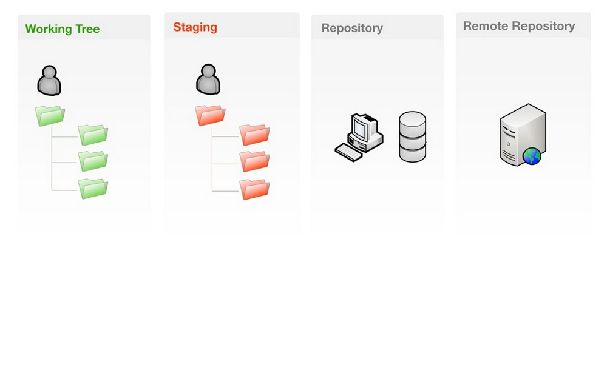
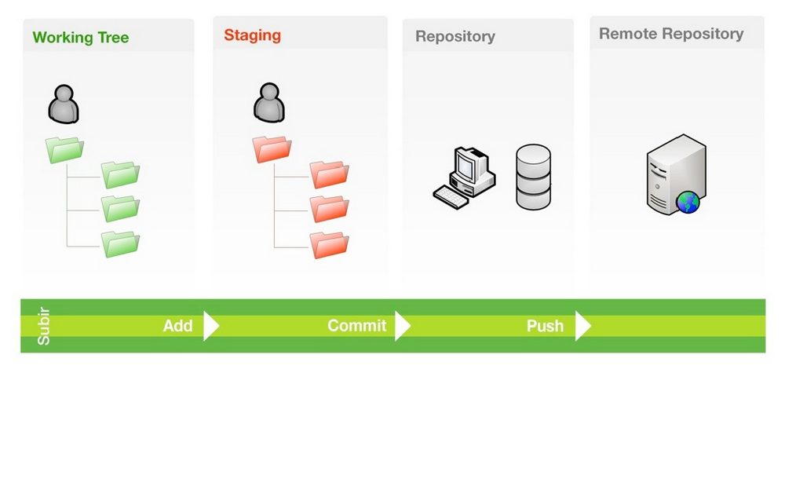
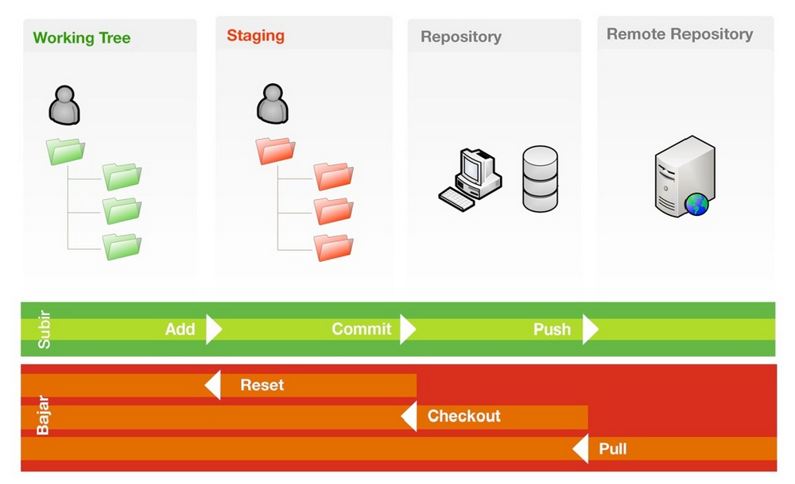
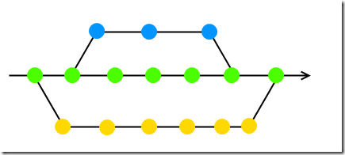
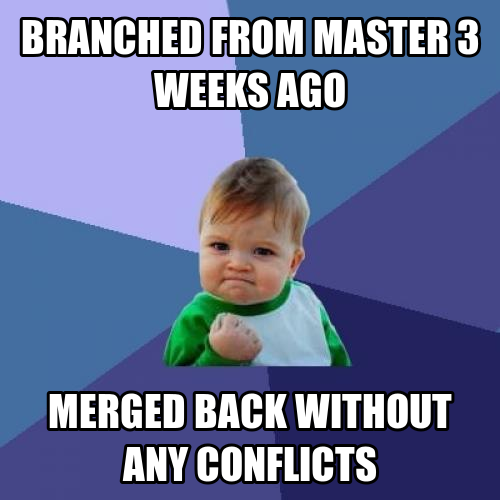
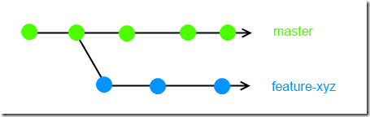
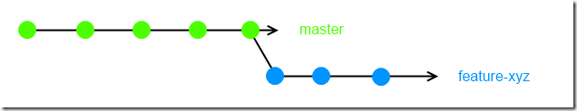

:title: Introducción a Git
:venue: 8vas Jornadas de Software Libre de la UNNOBA
:author: Martín Gaitán
:css: slides.css
:skip-help: true

Introducción al maravilloso
===============

.. image:: img/Git.png

Joaquín Delhom Viana / `@joadelvia <http://twitter.com/joadelvia>`_ / CC-by-sa

-----------------

-----

----

-----

:data-rotate: 0
:data-y: r1400

Instalación
-----------

**Windows**

*http://code.google.com/p/msysgit*

**Linux**

.. code:: bash

    apt-get install git

**OS X**

.. code:: bash

    brew install git

--------

:data-rotate: 90
:data-y: r1400

Configuración
-------------

¿Quién eres?

.. code:: bash

    git config --global user.name "Martín Gaitán"
    git config --global user.email gaitan@gmail.com

Tu editor

.. code:: bash

    git config --global core.editor vim

--------

Empezando
----------

Crear un repositorio local

.. code:: bash

    git init

Luego se pueden declarar repositorios remotos

.. code:: bash

    git remote add origin https://github.com/joadelvia/intro-git.git

O directamente clonar un repositorio

.. code:: bash

    git clone https://github.com/joadelvia/intro-git.git .

--------

Creando *commits*
------------------

Cambios específicos

.. code:: bash

    git add README.txt
    git commit -m 'Contenido básico en el README'

O todos los cambios en archivos *trackeados*

.. code:: bash

    git commit -am "El reactor nuclear funciona.
    >    Faltan tests del disparador"

---------

¿Dónde estoy?
--------------

La brújula

.. code:: bash

    git status

El libro de viaje

.. code:: bash

    git log

GUIs

.. code:: bash

    gitk / gitg / tig / qgit

---------

Deshaciendo
-------------

Corregir el último commit

.. code:: bash

    git commit --amend

Quitar del *stage* (deshacer git add)

.. code:: bash

    git reset HEAD file.py  # o bien
    git rm --cached file.py

Restaurar archivo (deshacer los cambios en un fichero)

.. code:: bash

    git checkout file.java  # por defecto ``HEAD``
    git checkout [REV] -- file.java     # SHA1, tag, rama

Revertir commit

.. code:: bash

    git revert 1776f5

--------

Borrando
---------

*Unstage* (quitar del proximo commit)

.. code:: bash

    git rm --cached file.py

Dejar de *trackear*:

.. code:: bash

    git rm file.py

------------

¿Qué cambié?
------------

Cambios locales

.. code:: bash

    git diff

Cambios en stage

.. code:: bash

    git diff --cached

Respecto a una revision

.. code:: bash

    git diff 1776f5

Visualmente

.. code:: bash

    meld .  # winmerge, kdiff3, otros...

--------

:data-rotate: 90
:data-x: r-1400

.gitignore
----------

No queremos control de **todo**

.. code:: bash

    *.pyc
    *.swp
    /build/
    /doc/[abc]*.txt
    .pypirc
    *.egg-info

.. note::

    • Blank lines or lines starting with # are ignored
    • Standard glob patterns work
    • End pattern with slash (/) to specify a directory
    • Negate pattern with exclamation point (!)

---------

:data-rotate: 90
:data-y: r1400

Repositorios remotos
--------------------

- Son técnicamente iguales a nuestra copia de trabajo
- Pueden ser locales o remotos (ssh, https, etc.)

.. code:: bash

    $ git remote -v
    origin git://github.com/joadelvia/intro-git.git (fetch)
    origin git://github.com/joadelvia/intro-git.git (push)

-------

:data-rotate: 90
:data-x: r-1400

Empujando al remoto
-------------------

Sin default

.. code:: bash

   git push <remote> <rbranch>

O definimos default remoto para la rama actual

.. code:: bash

    git push -u <remote> <rbranch>

Y luego

.. code:: bash

    git push

-------

:data-rotate: 90
:data-y: r1400

Traeme lo nuevo (pull)
-----------------------

.. code:: bash

    git pull [<remote> <rbranch>]

``pull == fetch + merge``

---------------

Crear tags
-----------

Ponerle "nombre" a una revisión.

.. code:: bash

    git tag v0.1.0

Los tags son locales, pero se pueden pushear

.. code:: bash

    git push --tags

----------------

Ramas
------

- Cambio de contexto indoloro (locales y rápidos)
- Son *punteros móviles* a un commit
- La rama por omisión se llama **master**

.. note::

     Factores externos necesitan inevitablemente de cambios de contexto.

     - Un bug severo se manifiesta en la última versión sin previo aviso.
     - El plazo para alguna presentación se acorta.
     - Un desarrollador que tiene que ayudar en una sección indispensable
       del proyecto está por tomar licencia.
     - Simplemente necesitas probar una idea

     En cualquier caso, debes soltar abruptamente lo que estás haciendo y enfocarte en una tarea completamente diferente.

-------

:data-rotate: 90
:data-x: r-1400

Creando una rama
----------------

.. code:: bash

    git branch experimento_loco
    git checkout experimento_loco

o directamente:

.. code:: bash

    git checkout -b experimento_loco

----------

Más comandos para ramas
------------------------

Cambiar de rama

.. code:: bash

    git checkout NOMBRE_RAMA

``checkout`` requiere todo *limpio*.
``stash`` es nuestra alfombra para esconder por un rato

.. code:: bash

    git stash
    git checkout NOMBRE_RAMA
    ...
    git checkout NOMBRE_RAMA_ORIGINAL
    git stash pop

----------

:data-rotate: 90
:data-y: r1400

Mezclar
--------

Desde otra rama. Ej: master

.. code:: bash

    git merge [--no-ff] experimento_loco

------

:data-rotate: 90
:data-x: r-1400

En general hace magia
----------------------

-----------

Pero a veces no alcanza (conflictos)
------------------------------------

Corregimos a mano

.. code:: bash

    [corregimos los conflictos en el editor]
    git add file.rb
    git commit -m 'mezclando la rama X. corregi a mano el merge ...'

O forzamos lo nuestro / lo de ellos

.. code:: bash

    git checkout --ours file.rb  # o --theirs
    git add file.rb
    git commit

-----

:data-rotate: 0
:data-y: r1400

Rebase
--------

- Mover el origen de la rama
- Muy útil para *reescribir la historia*
- Recomendado antes de un *merge* a **master**

.. code:: bash

    # en feature-xyz
    git rebase master

------

:data-rotate: 90
:data-y: r1400

Listo, dónde subo mi código?
----------------------------

- Bitbucket / Gitorius
- Server del trabajo / facu
- Pero especialmente...

.. image:: img/github_logo.jpg

---------

:data-rotate: 90
:data-x: r-1400

Github
-------

- No es sólo **hosting** git gratis (para software libre)
- Es una **plataforma social y profesional**
- ¡Colaborar con OSS nunca fue tan fácil!
- Gestión de proyectos / comunicación / revisión / etc.
- Enterarse de tendencias y aprender de cracks

-------

:data-rotate: 90
:data-y: r1400

Más info / práctica
--------------------

- Progit
- Git magic
- Githug
- Github help

---------

:data-rotate: 90
:data-rotate-y: 180
:data-y: r1400

Preguntas?
----------

----------

(Muchas gracias)
-----------------

.. note::

    Bibliografía

    http://dbrgn.ch/slides/20130207_getting_git/
    http://www.slideshare.net/CarlosTaborda/why-git-sucks-and-youll-use-it-anyways
    http://www.slideshare.net/leo.soto/introduccin-a-git
    https://speakerdeck.com/schacon/introduction-to-git
    http://www.slideshare.net/mickaeltr/git-github-leverage-your-open-source-projects
    http://www.slideshare.net/anildigital/git-introduction
